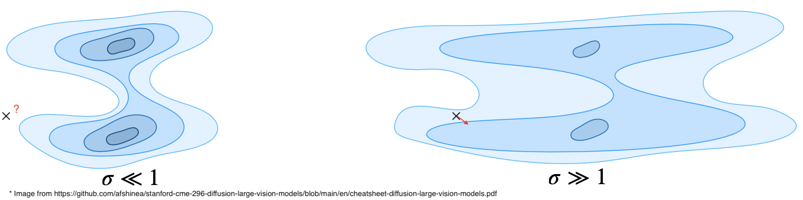

This post was inspired by the Stanford course on diffusion models, [CME296](https://cme296.stanford.edu/), by Afshine Amidi and Shervine Amidi, and is intended to provide a detailed review of the theoretical background of diffusion models.

We review the derivation of the loss functions and the underlying principles behind the current training and inference algorithms. It requires a basic familiarity with diffusion models to begin with.

## PARADIGM 1: DDPM

### Basic equations


$$
x_{t+1} = \sqrt{1-\beta_t}\,x_t + \sqrt{\beta_t}\,\epsilon \qquad \text{with } \beta_t \text{ noise schedule}
$$


which can be rewritten as:


$$

x_t = \sqrt{\bar{\alpha}_t}\,x_0 + \sqrt{1-\bar{\alpha}_t}\,\epsilon 
\qquad
\text{with } \epsilon \sim \mathcal{N}(0,1),\quad
\alpha_t = 1-\beta_t,\quad
\bar{\alpha}_t = \prod_{s=1}^{t} \alpha_s

$$


---

### Deriving ELBO
The objective of our model is to *correctly* reconstruct the original image, $x_0$. Therefore, our goal is to maximize the expected value of $\log p_\theta(x_0)$ over all possible $x_0$. However, computing $p_\theta(x_0)$ requires marginalizing over all latent variables:


$$

p_\theta(x_0)
=
\int p_\theta(x_{0:T})\,dx_{1:T}
=
\int p(x_T)\prod_{t=1}^{T} p_\theta(x_{t-1}\mid x_t)\,dx_{1:T}.

$$


Directly optimizing this objective is intractable because it involves a high-dimensional integral over all latent variables, with the logarithm applied outside the integral. Therefore, instead of maximizing the exact log-likelihood, we derive and maximize a variational lower bound:


$$

p_\theta(x_0)
=
\int p_\theta(x_{0:T})\,dx_{1:T}
=
\int q(x_{1:T}\mid x_0)\,
\frac{p_\theta(x_{0:T})}{q(x_{1:T}\mid x_0)}
\,dx_{1:T}.

$$


This is an expectation over $q(x_{1:T}\mid x_0)$:


$$

p_\theta(x_0)
=
\mathbb{E}_{x_{1:T} \sim q(x_{1:T}\mid x_0)}
\left[
\frac{p_\theta(x_{0:T})}{q(x_{1:T}\mid x_0)}
\right].

$$


Take the logarithm:


$$

\log p_\theta(x_0)
=
\log
\mathbb{E}_{x_{1:T} \sim q(x_{1:T}\mid x_0)}
\left[
\frac{p_\theta(x_{0:T})}{q(x_{1:T}\mid x_0)}
\right].

$$


Now, apply Jensen's inequality:


$$

\log
\mathbb{E}_{x_{1:T} \sim q(x_{1:T}\mid x_0)}
\left[
\frac{p_\theta(x_{0:T})}{q(x_{1:T}\mid x_0)}
\right]
\ge
\mathbb{E}_{x_{1:T} \sim q(x_{1:T}\mid x_0)}
\left[
\log
\frac{p_\theta(x_{0:T})}{q(x_{1:T}\mid x_0)}
\right].

$$


Therefore:


$$

\log p_\theta(x_0)
\ge
\mathbb{E}_{x_{1:T} \sim q(x_{1:T}\mid x_0)}
\left[
\log \frac{p_\theta(x_{0:T})}{q(x_{1:T}\mid x_0)}
\right].

$$


Take the expectation over $x_0 \sim q(x_0)$:


$$

\mathbb{E}_{x_0 \sim q(x_0)}\big[\log p_\theta(x_0)\big]
\;\ge\;
\boxed{
\mathbb{E}_{x_{0:T} \sim q(x_{0:T})}
\left[
\log \frac{p_\theta(x_{0:T})}{q(x_{1:T}\mid x_0)}
\right]
}
=
\text{ELBO}

$$


---
### Writing ELBO as a tractable KL divergence

That ELBO could be rewrritten as:


$$

\mathcal{L}
=
\mathbb{E}_{x_{0:T}\sim q(x_{0:T})}
\left[
\log \frac{p_\theta(x_{0:T})}{q(x_{1:T}\mid x_0)}
\right]

$$



$$

=
\mathbb{E}_{x_{0:T}\sim q(x_{0:T})}
\left[
\log
\frac{
p(x_T)\prod_{t=1}^{T}p_\theta(x_{t-1}\mid x_t)
}{
q(x_{1:T}\mid x_0)
}
\right]

$$



$$

=
\mathbb{E}_{x_{0:T}\sim q(x_{0:T})}
\left[
\log
\frac{
p(x_T)\prod_{t=1}^{T}p_\theta(x_{t-1}\mid x_t)
}{
\prod_{t=1}^{T}q(x_t\mid x_{t-1},x_0)
}
\right]

$$



$$

=
\mathbb{E}_{x_{0:T}\sim q(x_{0:T})}
\left[
\log
\frac{
p(x_T)\prod_{t=1}^{T}p_\theta(x_{t-1}\mid x_t)
}{
\prod_{t=1}^{T}q(x_t\mid x_{t-1})
}
\right] \text{(Markov chain property)}

$$



$$

=
\mathbb{E}_{x_{0:T}\sim q(x_{0:T})}
\left[
\log p(x_T)
+\sum_{t=1}^{T}\log p_\theta(x_{t-1}\mid x_t)
-\sum_{t=1}^{T}\log q(x_t\mid x_{t-1}, x_0)
\right]

$$



$$

=
\mathbb{E}_{x_{0:T}\sim q(x_{0:T})}
\left[
\log p(x_T) + \log p_\theta(x_0\mid x_1) - \log q(x_1\mid x_0) + \sum_{t=2}^{T}\log\frac{p_\theta(x_{t-1}\mid x_t)}{q(x_t\mid x_{t-1})}\right
]  \text{(Split off $t=1$)}

$$


**Bayes' rule** $q(x_t \mid x_{t-1}) = q(x_{t-1}\mid x_t, x_0)\,\dfrac{q(x_t\mid x_0)}{q(x_{t-1}\mid x_0)}$:


$$

= \mathbb{E}_{x_{0:T}\sim q(x_{0:T})}\left[\log p(x_T) + \log p_\theta(x_0\mid x_1) - \log q(x_1\mid x_0) + \sum_{t=2}^{T}\log\frac{p_\theta(x_{t-1}\mid x_t)}{q(x_{t-1}\mid x_t,x_0)} + \underbrace{\sum_{t=2}^{T}\log\frac{q(x_{t-1}\mid x_0)}{q(x_t\mid x_0)}}_{\log q(x_1\mid x_0)\,-\,\log q(x_T\mid x_0)}\right]

$$



$$

=
\mathbb{E}_{x_{0:T}\sim q(x_{0:T})}
\left[
\log p_\theta(x_0\mid x_1) + \log\frac{p(x_T)}{q(x_T\mid x_0)} + \sum_{t=2}^{T}\log\frac{p_\theta(x_{t-1}\mid x_t)}{q(x_{t-1}\mid x_t,x_0)}\right] \text{($\log q(x_1|x_0)$ got cancelled)}

$$



$$

=
\boxed{
-\sum_{t=2}^{T}
\mathrm{KL}\big(q(x_{t-1}\mid x_t,x_0)\,\|\,p_\theta(x_{t-1}\mid x_t)\big)
}
+\text{extra terms}

$$


--- 
### Why ELBO is tractable?

Now, we show that ELBO is tractable.

#### $q(x_{t-1}\mid x_t,x_0)$: 


$$

\boxed{
q(x_{t-1}\mid x_t,x_0)=\mathcal N(x_{t-1};\tilde\mu_t,\tilde\beta_t I)
}

$$


with


$$

\tilde\mu_t
=

\frac{1}{\sqrt{\alpha_t}}
\left(
x_t-\frac{1-\alpha_t}{\sqrt{1-\bar\alpha_t}},\epsilon_t
\right)

$$


And

$$

\tilde\beta_t
=
\frac{1-\bar\alpha_{t-1}}{1-\bar\alpha_t}\beta_t

$$


where:

* $x_t$: the noisy image at timestep $t$
* $\epsilon_t$: the sampled Gaussian noise used to transform the clean image into a noisy image at timestep $t$

Start from:


$$

q(x_t \mid x_{t-1})=\mathcal N\left(x_t;\sqrt{\alpha_t},x_{t-1},,\beta_t I\right),
\qquad \alpha_t=1-\beta_t

$$


and:


$$

q(x_t\mid x_0)=\mathcal N\left(x_t;\sqrt{\bar\alpha_t},x_0,,(1-\bar\alpha_t)I\right),
\qquad
\bar\alpha_t=\prod_{s=1}^t \alpha_s.

$$


By Bayes:


$$

q(x_{t-1}\mid x_t,x_0)
=

\frac{q(x_t\mid x_{t-1},x_0),q(x_{t-1}\mid x_0)}{q(x_t\mid x_0)}.

$$


And because the forward process is Markov,


$$

q(x_t\mid x_{t-1},x_0)=q(x_t\mid x_{t-1}),

$$


So (from here you see both terms are tractable):


$$

q(x_{t-1}\mid x_t,x_0)
\propto
q(x_t\mid x_{t-1}),q(x_{t-1}\mid x_0).
$$
 

Now plug in both Gaussians:


$$

q(x_t\mid x_{t-1})
=

\mathcal N(x_t;\sqrt{\alpha_t}x_{t-1},\beta_t I),

$$



$$

q(x_{t-1}\mid x_0)
=

\mathcal N(x_{t-1};\sqrt{\bar\alpha_{t-1}}x_0,(1-\bar\alpha_{t-1})I).

$$


Thus


$$

q(x_{t-1}\mid x_t,x_0)
\propto
\mathcal N(x_t;\sqrt{\alpha_t}x_{t-1},\beta_t I),
\mathcal N(x_{t-1};\sqrt{\bar\alpha_{t-1}}x_0,(1-\bar\alpha_{t-1})I).

$$


This is a product of Gaussians in $x_{t-1}$, so it must also be Gaussian in $x_{t-1}$:

**First term**:


$$

\mathcal N(x_t;\sqrt{\alpha_t}x_{t-1},\beta_t I)
\propto
\exp\left(
-\frac{1}{2\beta_t}|x_t-\sqrt{\alpha_t}x_{t-1}|^2
\right).

$$


Expand:


$$

|x_t-\sqrt{\alpha_t}x_{t-1}|^2
=

x_t^\top x_t
-2\sqrt{\alpha_t}x_t^\top x_{t-1}
+\alpha_t x_{t-1}^\top x_{t-1}.

$$


So this contributes


$$

-\frac{1}{2\beta_t}
\left(
x_t^\top x_t
-2\sqrt{\alpha_t}x_t^\top x_{t-1}
+\alpha_t x_{t-1}^\top x_{t-1}
\right).

$$


**Second term**


$$

\mathcal N(x_{t-1};\sqrt{\bar\alpha_{t-1}}x_0,(1-\bar\alpha_{t-1})I)
\propto
\exp\left(
-\frac{1}{2(1-\bar\alpha_{t-1})}
|x_{t-1}-\sqrt{\bar\alpha_{t-1}}x_0|^2
\right).

$$


Expand:


$$

|x_{t-1}-\sqrt{\bar\alpha_{t-1}}x_0|^2
=

x_{t-1}^\top x_{t-1}
-2\sqrt{\bar\alpha_{t-1}}x_0^\top x_{t-1}
+\bar\alpha_{t-1}x_0^\top x_0.

$$


So this contributes:


$$

-\frac{1}{2(1-\bar\alpha_{t-1})}
\left(
x_{t-1}^\top x_{t-1}
-2\sqrt{\bar\alpha_{t-1}}x_0^\top x_{t-1}
+\bar\alpha_{t-1}x_0^\top x_0
\right).

$$


Ignoring constants independent of $x_{t-1}$, the exponent of the product becomes:


$$

-\frac12
\left[
\left(
\frac{\alpha_t}{\beta_t}
+\frac{1}{1-\bar\alpha_{t-1}}
\right)x_{t-1}^\top x_{t-1}
-

2\left(
\frac{\sqrt{\alpha_t}}{\beta_t}x_t
+
\frac{\sqrt{\bar\alpha_{t-1}}}{1-\bar\alpha_{t-1}}x_0
\right)^\top x_{t-1}
\right].

$$


This has the canonical Gaussian form:


$$

-\frac12\left[
x^\top A x - 2b^\top x
\right]

$$


with


$$

A=
\left(
\frac{\alpha_t}{\beta_t}
+\frac{1}{1-\bar\alpha_{t-1}}
\right)I,

$$



$$

b=
\frac{\sqrt{\alpha_t}}{\beta_t}x_t
+
\frac{\sqrt{\bar\alpha_{t-1}}}{1-\bar\alpha_{t-1}}x_0.

$$


Therefore


$$

\boxed{
q(x_{t-1}\mid x_t,x_0)=\mathcal N(x_{t-1};\tilde\mu_t,\tilde\beta_t I)
}

$$


with


$$

\tilde\beta_t = A^{-1}
=

\left(
\frac{\alpha_t}{\beta_t}
+\frac{1}{1-\bar\alpha_{t-1}}
\right)^{-1},

$$


and


$$

\tilde\mu_t = A^{-1}b.

$$


Simplify the variance:


$$

\tilde\beta_t
=

\left(
\frac{\alpha_t}{\beta_t}
+
\frac{1}{1-\bar\alpha_{t-1}}
\right)^{-1}

$$



$$

=
\left(
\frac{\alpha_t(1-\bar\alpha_{t-1})+\beta_t}{\beta_t(1-\bar\alpha_{t-1})}
\right)^{-1}

$$



$$

=
\frac{\beta_t(1-\bar\alpha_{t-1})}{\alpha_t(1-\bar\alpha_{t-1})+\beta_t}

$$



$$

\alpha_t(1-\bar\alpha_{t-1})+\beta_t
=

\alpha_t-\alpha_t\bar\alpha_{t-1}+\beta_t

$$



$$

=
\alpha_t-\alpha_t\bar\alpha_{t-1}+1-\alpha_t

$$



$$

=
1-\alpha_t\bar\alpha_{t-1}

$$



$$

=
1-\bar\alpha_t

$$



$$

\tilde\beta_t
=

\frac{\beta_t(1-\bar\alpha_{t-1})}{1-\bar\alpha_t}

$$



$$

\boxed{
\tilde\beta_t
=
\frac{1-\bar\alpha_{t-1}}{1-\bar\alpha_t}\beta_t
}

$$


**Simplify the mean**


$$

\tilde\mu_t
=

\tilde\beta_t
\left(
\frac{\sqrt{\alpha_t}}{\beta_t}x_t
+
\frac{\sqrt{\bar\alpha_{t-1}}}{1-\bar\alpha_{t-1}}x_0
\right).

$$


Substitute $\tilde\beta_t=\dfrac{1-\bar\alpha_{t-1}}{1-\bar\alpha_t}\beta_t$:


$$

\tilde\mu_t(x_t,x_0)
=

\frac{\sqrt{\alpha_t}(1-\bar\alpha_{t-1})}{1-\bar\alpha_t}x_t
+
\frac{\sqrt{\bar\alpha_{t-1}}\beta_t}{1-\bar\alpha_t}x_0.

$$


Since $x_t=\sqrt{\bar\alpha_t}x_0+\sqrt{1-\bar\alpha_t}\epsilon_t$ and $x_0=\frac{1}{\sqrt{\bar\alpha_t}}\left(x_t-\sqrt{1-\bar\alpha_t},\epsilon_t\right)$:


$$

\tilde\mu_t(x_t,x_0)
=
\frac{1}{\sqrt{\alpha_t}}
\left(
x_t -
\frac{1-\alpha_t}{\sqrt{1-\bar\alpha_t}}\epsilon_t
\right)
.

$$


Since $1-\alpha_t=\beta_t$:


$$

\boxed{
\tilde\mu_t
=

\frac{1}{\sqrt{\alpha_t}}
\left(
x_t
-

\frac{\beta_t}{\sqrt{1-\bar\alpha_t}}\epsilon_t
\right)
}.

$$


#### $p_\theta(x_t-1|x_t)$:

We assume that $p_\theta$ is Gaussian:


$$

\boxed{
p_\theta(x_{t-1}\mid x_t)=\mathcal N\bigl(\mu_\theta(x_t,t),\Sigma_\theta(x_t,t)\bigr)
}

$$


Justification: if $q(x_t\mid x_{t-1})$ is Gaussian, then $q(x_{t-1}\mid x_t)$ is approximately Gaussian (because $q(x_{t-1})\approx \mathcal N(m,C)$ becomes Gaussian-like after many small Gaussian noise steps.

### Loss function

From above:


$$
q(x_{t-1}\mid x_t,x_0)=\mathcal N(x_{t-1};\tilde\mu_t,\tilde\beta_t I)
$$


$$
p_\theta(x_{t-1}\mid x_t)=\mathcal N(x_{t-1};\mu_\theta(x_t,t),\Sigma_\theta(x_t,t))
$$


Fix $\Sigma_\theta(x_t,t)=\tilde\beta_t I$, then KL between Gaussians with equal covariance:


$$
q(x_{t-1}\mid x_t,x_0)=\mathcal N(\tilde\mu_t,\tilde\beta_t I)
$$



$$
p_\theta(x_{t-1}\mid x_t)=\mathcal N(\mu_\theta,\tilde\beta_t I)
$$



$$

D_{\mathrm{KL}}(q||p_\theta)
=
\mathbb E_q\left[
\log \frac{q(x_{t-1}\mid x_t,x_0)}{p_\theta(x_{t-1}\mid x_t)}
\right]

$$



$$

=
\mathbb E_q\left[
\log
\frac{
\exp\left(-\frac{1}{2\tilde\beta_t}\left\|x_{t-1}-\tilde\mu_t\right\|^2\right)
}{
\exp\left(-\frac{1}{2\tilde\beta_t}\left\|x_{t-1}-\mu_\theta\right\|^2\right)
}
\right]

$$



$$

=
\mathbb E_q\left[
-\frac{1}{2\tilde\beta_t}\left\|x_{t-1}-\tilde\mu_t\right|^2
+
\frac{1}{2\tilde\beta_t}\left\|x_{t-1}-\mu_\theta\right\|^2
\right]

$$



$$

=
\frac{1}{2\tilde\beta_t}
\mathbb E_q\left[
\left\|x_{t-1}-\mu_\theta\right\|^2
-
\left\|x_{t-1}-\tilde\mu_t\right\|^2
\right]

$$



$$

\left\|x_{t-1}-\mu_\theta\right\|^2
=
\left\|x_{t-1}-\tilde\mu_t+\tilde\mu_t-\mu_\theta\right\|^2

$$



$$

=
\left\|x_{t-1}-\tilde\mu_t\right\|^2
+
2(x_{t-1}-\tilde\mu_t)^\top(\tilde\mu_t-\mu_\theta)
+
\left\|\tilde\mu_t-\mu_\theta\right\|^2

$$



$$

D_{\mathrm{KL}}(q||p_\theta)
=
\frac{1}{2\tilde\beta_t}
\mathbb E_q\left[
2(x_{t-1}-\tilde\mu_t)^\top(\tilde\mu_t-\mu_\theta)
+
||\tilde\mu_t-\mu_\theta||^2
\right]

$$



$$

=
\frac{1}{2\tilde\beta_t}
\left[
2\mathbb E_q[x_{t-1}-\tilde\mu_t]^\top(\tilde\mu_t-\mu_\theta)
+
\left\|\tilde\mu_t-\mu_\theta\right\|^2
\right]

$$



$$

\mathbb E_q[x_{t-1}]=\tilde\mu_t

$$



$$

\mathbb E_q[x_{t-1}-\tilde\mu_t]=0

$$



$$

D_{\mathrm{KL}}(q||p_\theta)
=

\frac{1}{2\tilde\beta_t}
\left\|\tilde\mu_t-\mu_\theta\right\|^2

$$


Therefore:

$$

\mathcal L_t
\propto
\mathbb E_{x_0,\epsilon,t}
\left[
\left\|\tilde\mu_t-\mu_\theta(x_t,t)\right\|^2
\right].

$$


Fix and parameterize $\mu_\theta(x_t,t)$ as:


$$

\mu_\theta(x_t,t)
=
\frac{1}{\sqrt{\alpha_t}}
\left(
x_t-\frac{\beta_t}{\sqrt{1-\bar\alpha_t}}\epsilon_\theta(x_t,t)
\right)

$$


And given $\tilde\mu_t=\frac{1}{\sqrt{\alpha_t}}\left(x_t-\frac{\beta_t}{\sqrt{1-\bar\alpha_t}}\epsilon\right)$:


$$

\mathcal L_t
\propto
\mathbb E_{x_0,\epsilon,t}
\left[
\left\|
\frac{1}{\sqrt{\alpha_t}}
\left(
x_t-\frac{\beta_t}{\sqrt{1-\bar\alpha_t}}\epsilon
\right)
-
\frac{1}{\sqrt{\alpha_t}}
\left(
x_t-\frac{\beta_t}{\sqrt{1-\bar\alpha_t}}\epsilon_\theta(x_t,t)
\right)
\right\|^2
\right]

$$



$$

=
\mathbb E_{x_0,\epsilon,t}
\left[
\left\|
\frac{\beta_t}{\sqrt{\alpha_t}\sqrt{1-\bar\alpha_t}}
\left(
\epsilon-\epsilon_\theta(x_t,t)
\right)
\right\|^2
\right]

$$

$\frac{\beta_t}{\sqrt{\alpha_t}\sqrt{1-\bar\alpha_t}}$ is constant, so:

$$

\propto
\mathbb E_{x_0,\epsilon,t}
\left[
\left\|\epsilon-\epsilon_\theta(x_t,t)\right\|^2
\right]

$$



$$

x_t
=
\sqrt{\bar\alpha_t}x_0+\sqrt{1-\bar\alpha_t}\epsilon

$$



$$

\boxed{
\mathcal L_{\mathrm{DDPM}}
=
\mathbb E_{t,x_0,\epsilon}
\left[
\left\|
\epsilon_\theta\left(
\sqrt{\bar\alpha_t}x_0+\sqrt{1-\bar\alpha_t}\epsilon,\ t
\right)
-\epsilon
\right\|^2
\right]
}

$$



$$
t\sim \mathcal U\{1,T\},\qquad x_0\sim q_0(x_0),\qquad\epsilon\sim\mathcal N(0,I)
$$


So maximizing $p_\theta(x_0)$ is equivalent to minimizing the $\ell_2$ distance between the noise predicted by the model and the actual noise that was added to obtain the noisy images.

The training process is to generate noisy images with $t$ from $0:T$, then take each step, starting from $T$, give the noisy image at $t$ to the model, model predicts how much noise was added to it, then compute and minimize the loss.

For inference, Take the image build from noise $\mathcal N(0,I)$, and construct $x_t-1$ from $x_t$ like this:

$$
x_{t-1}=\frac{1}{\sqrt{\alpha_t}}\left(x_t-\frac{1-\alpha_t}{\sqrt{1-\bar\alpha_t}}\epsilon_\theta(x_t,t)\right)+\sigma_t z.
$$


(Previously, we showed that we parametarazied $p_\theta(x_t-1|x_t)$ as:

$$
p_\theta(x_{t-1}\mid x_t)=\mathcal N\bigl(\mu_\theta(x_t,t)\Sigma_\theta(x_t,t)\bigr)
$$


with

$$
\mu_\theta(x_t,t)=\frac{1}{\sqrt{\alpha_t}}\left(x_t-\frac{1-\alpha_t}{\sqrt{1-\bar\alpha_t}}\epsilon_\theta(x_t,t)\right)
$$


and


$$

\Sigma_\theta(x_t,t)=\sigma_t^2 I.

$$

with 

$$

\sigma_t^2=\tilde\beta_t.

$$

)

### DDIM

For DDIM, when generating $x_t-1$ from $x_t$, the process is deterministic. Therefore (just rearrange $x_t=\sqrt{\bar\alpha_t}x_0+\sqrt{1-\bar\alpha_t},\epsilon$):


$$
\hat x_0(x_t)=\frac{x_t-\sqrt{1-\bar\alpha_t},\epsilon_\theta(x_t,t)}{\sqrt{\bar\alpha_t}}
$$



$$
x_{t-1}=\sqrt{\bar\alpha_{t-1}},\hat x_0(x_t)+\sqrt{1-\bar\alpha_{t-1}}\epsilon_\theta(x_t,t)
$$


One limitation of DDPM is that timestep skipping degrades sample quality, because each reverse step both denoises and injects Gaussian noise $\sigma_t z_t$; skipping many such steps breaks the approximation the reverse Markov chain relies on.

## PARADIGM 2: Score matching (Langevin Dynamics)

The idea is that we want to generate a realistic image, and therefore sample from the distribution of realistic images, $p_{\text{data}}$, which is unknown and difficult to sample from directly. One approach is to start from a simpler distribution that is easy to sample from, and then iteratively update the samples so that they move toward regions with higher probability under $p_{\text{data}}$.

To do this, we use the score function of $p_{\text{data}}$, which is easier to work with:


$$

\nabla_x \log p_{\text{data}}(x).

$$


One important reason is that the normalization constant disappears during differentiation, since


$$

\nabla_x \log Z_\theta = 0,

$$


meaning we do not need to compute the intractable normalizing constant:


$$

x_t = x_{t-1} + \frac{\alpha_i}{2}\, \nabla_x \log p_\text{data}(x_{t-1}) + \sqrt{\alpha_i}\epsilon_t

$$


We add Gaussian noise to the images to "fill" the entire space with some probability mass. The parameter $\alpha_i$ arises from the discretization of an underlying stochastic differential equation (SDE), which will be discussed in more detail below. The $\sqrt{\alpha}$ term comes from the fact that the SDE contains a Wiener process whose variance is (dt) (equivalent to (\alpha) after discretization), and therefore whose standard deviation is (\sqrt{dt}).

Then why 1/2 for gradient update coefficient? That requires more depth.

There is at least one other phenomenon in the world around us that, much like machine learning diffusion models, consists of progressively adding randomness over multiple steps: the diffusion of gas molecules in a room 🌚. That is, in fact, where the name *diffusion* comes from. This formula $x_t = x_{t-1} + \frac{\alpha_i}{2}\, \nabla_x \log p_\text{data}(x_{t-1}) + \sqrt{\alpha_i}\epsilon_t$ is exactly the location of a molecule at the time $t$ which can be calculated using the posisiton at time $t-1$. In fact, this formula is the descretized form of this continous relationship:

$$

dx_t = \lim_{dt \to 0} x_t+dt - x_{t} =  \frac{1}{2} \nabla_x \log p_\text{data}(x_{t-1})dt + dW_t

$$


Where $W_t$ represents Brownian motion and is a normal varirable whose value is continously changing over time and its variance increasing with time distance. Therefore, $W_t \sim \mathcal N(0, t)$ is the total accumulated randomness up to time $t$, and $dW_t \sim \mathcal N(0,dtI)$ is tiny new random increment added during $dt$. Thus, when we descritize the process, $dW_t$ turns into a normal variable with the variance of step size $\sqrt{\alpha}\sigma$.

$\alpha_i$ controls the degree to which we discretize the underlying continuous process. This is reasonable because, in the molecular diffusion analogy, time is continuous, and the forces acting on each molecule can occur at any instant in time.

Therefore, if we explain where the $\frac{1}{2}$ term comes from in $dx = \frac{1}{2}\nabla_x \log p_{\text{data}}(x_{t-1})\,dt + dW_t$, the same explanation also applies to the $\frac{1}{2}$ term in the discretized equation $x_t = x_{t-1} + \frac{\alpha_i}{2},\nabla_x \log p_{\text{data}}(x_{t-1}) + \sqrt{\alpha_i}\epsilon_t.$

We can write (dx) in the more general form called an Itô stochastic differential equation:

$$

dx = f(x)dt + g(x)dW.

$$


Now that we've introduced the “molecules” analogy, we can show that specific choices of the drift $f(x)$ and diffusion $g(x)$ determine the stationary final distribution of the molecules. In diffusion models, the goal is to choose the drift term so that the reverse process converges toward the data distribution $p_{\text{data}}$.

To find the stationary distribution of the process, we use Fokker-Planck equation of that Itô SDE. We take $\rho(x,t)$ as the pdf of molecules, and want to find a distribution where $\frac{\partial \rho(x,t)}{\partial t} = 0$, meaning its stationary.

To find $\frac{\partial \rho(x,t)}{\partial t} = 0$, we have to define a test function $\phi(x)$. We want to reach an equation that is true for any smooth $\phi(x)$.

First, :

$$

d\phi(x) = \phi(x + dx) - \phi(x)  

$$


Expand the first around $x$, cancel $\phi(x)$ and note that $u = x+dx$, $\frac{du}{dx}=1$ and $\frac{d f(x+dx)}{dx} = \frac{d f(u)}{du}\frac{du}{dx} = \frac{d f(u)}{du}$

$$

d\phi(x) = \sum_{j=1}^{\infty}{\frac{\phi(x)^{(j)}}{j}dx^j}

$$


In ordinary differential equations, we usually treat terms of order $dx^j$ for $j > 1$ as negligible. However, for random motion in space, these higher-order terms are no longer negligible, because random infinitesimal movements can accumulate together (for example, two small movements occurring in the same direction). Therefore, unlike ordinary calculus, we cannot stop at the first derivative term alone:


$$
d\phi(x) = \frac{\partial \phi}{\partial x} dx + \frac{1}{2} \frac{\partial^2 \phi}{\partial x^2} (dx)^2
$$


Also, please note that $(dW)^2 \approx dt$ :), since: 

$$
Var(dW) = dt = E(dW^2) - E(dW)^2 = E(dW^2) \quad \text{since $dW \sim \mathcal N(0,dt)$}
$$

but:

$$

Var(dW^2) = E(dW^4) - E(dW^2)^2 = 3dt^2 - dt^2 = 2dt^2 \text{which goes to zero faster than $dt$ as $dt\to0$.}

$$

So $(dW)^2$ is a random variable with mean of $dt$ and a very tiny variance.

Substituting $dx = f dt + g dW$ and using the Itô rule $(dW)^2 = dt$ (while terms like $dt^2$ and $dt dW$ vanish):

$$
d\phi(x) = \left[ f(x) \frac{\partial \phi}{\partial x} + \frac{1}{2} g(x)^2 \frac{\partial^2 \phi}{\partial x^2} \right] dt + g(x) \frac{\partial \phi}{\partial x} dW
$$

Now, taking expectation over $x \sim \rho(x,t)$ from both sides, while $E(dW) = 0$

$$

\begin{align*}
\frac{d}{dt} E[\phi(x(t))] &= E\left[ f(x) \frac{\partial \phi}{\partial x} + \frac{1}{2} g(x)^2 \frac{\partial^2 \phi}{\partial x^2} \right] \\
\int \phi(x) \frac{\partial \rho(x,t)}{\partial t} dx &= \int \left[ f(x) \frac{\partial \phi}{\partial x} + \frac{1}{2} g(x)^2 \frac{\partial^2 \phi}{\partial x^2} \right] \rho(x,t) dx
\end{align*}

$$


Integration by parts :
We assume $\rho$ and its derivatives vanish at the boundaries ($x \to \pm \infty$). Because $\rho$ is a pdf and can not have be positive everywhere in the world since it has to sum to 1.

*   **For the first term:**
    
$$
\int_{-\infty}^{\infty} \left( \rho f \frac{\partial \phi}{\partial x} \right) dx = \rho f \phi\Big|_{-\infty}^{\infty} - \int \phi \frac{\partial}{\partial x} (f \rho) dx = - \int \phi \frac{\partial}{\partial x} (f \rho)
$$

*   **For the second term (integrate by parts twice):**
    
$$
\int_{-\infty}^{\infty} \left( \frac{1}{2} \rho g^2 \frac{\partial^2 \phi}{\partial x^2} \right) dx = \int \phi \frac{\partial^2}{\partial x^2} \left( \frac{1}{2} g^2 \rho \right) dx
$$


Substitute these back into the equation:

$$
\int \phi(x) \frac{\partial \rho}{\partial t} dx = \int \phi(x) \left[ -\frac{\partial}{\partial x} (f \rho) + \frac{1}{2} \frac{\partial^2}{\partial x^2} (g^2 \rho) \right] dx
$$


Since this equality must hold for **any** arbitrary test function $\phi(x)$, the terms inside the integrals must be equal:

$$
\frac{\partial \rho(x,t)}{\partial t} = -\frac{\partial}{\partial x} [f(x)\rho(x,t)] + \frac{1}{2} \frac{\partial^2}{\partial x^2} [g(x)^2 \rho(x,t)]
$$


In multi-dimensional vector notation, the partial derivatives $\frac{\partial}{\partial x}$ become the divergence $\nabla \cdot$ and the Laplacian $\nabla^2$ operators:

$$

\boxed{
\frac{\partial \rho}{\partial t} = -\nabla \cdot [f\rho] + \frac{1}{2} \nabla^2 [g^2 \rho]
}

$$


Substitute our $f(x)$ and $g(x)$ into the equation:


$$

\frac{\partial \rho}{\partial t} = -\nabla \cdot \left( \frac{1}{2} (\nabla \log p) \rho \right) + \frac{1}{2} \nabla^2 \rho

$$


To obtain a stationary state, set $\frac{\partial \rho}{\partial t} = 0$:

$$

0 = -\frac{1}{2} \nabla \cdot [(\nabla \log p) \rho] + \frac{1}{2} \nabla \cdot [\nabla \rho] \\
\nabla \cdot [(\nabla \log p) \rho] = \nabla \cdot [\nabla \rho]

$$


This equation holds, if $\rho=p$. Therefore, for those specific $f(x,t)=\frac12 \nabla_x \log p_{\mathrm{data}}(x)$ and $g(x,t)=1$, the stationary distribution, $\rho(x,t)$ is equal to the distribution $p$ that we want to sample from.

But one problem still remains, and thats we dont have $p_\text{data}$ and therefore its score function. :)

So, we have to find an estimation of score function of $p_\text{data}$, $s_\theta(x)$, ideally through minimzing:

$$

\mathcal{L}_{\mathrm{SM}}=\mathbb{E}_x\left[\left\|s_\theta(x)-\nabla_x \log p_{\mathrm{data}}(x)\right\|^2\right]

$$


But again, we do not have $p_\text{data}$.

However, we can make $p_\text{data}$ easier to sample from by adding noise to its samples (for now, only one step). let:

$$

\tilde{x} = x + \sigma \epsilon \qquad \text{with} \qquad \epsilon \sim \mathcal{N}(0, I)

$$


Therefore:


$$

q_\sigma(\tilde{x}\mid x) = \mathcal{N}(x, \sigma^2 I) \;\longrightarrow\; \nabla_{\tilde{x}} \log q_\sigma(\tilde{x}\mid x) = - \frac{\tilde{x}-x}{\sigma^2} \\
\text{and} \\ 
q_\sigma(\tilde{x}) = \int q_\sigma(\tilde{x}\mid x)\, p_{\mathrm{data}}(x)\, dx

$$


Then, you can replce $p_\text{data}$ with noised data distribution, $\log q_\sigma(\tilde{x})$, which is easier to sample from:

$$

\begin{align*}
\mathcal{L}_{\mathrm{SM}}(q_\sigma) &= \mathbb{E}_{\tilde{x}} \left[ \left\| s_\theta(\tilde{x}) - \nabla_{\tilde{x}} \log q_\sigma(\tilde{x}) \right\|^2 \right] \\
&= \mathbb{E}_{x,\tilde{x}} \left[ \| s_\theta(\tilde{x}) - \underbrace{\nabla_{\tilde{x}} \log q_\sigma(\tilde{x}\mid x)}_{-\frac{\tilde{x}-x}{\sigma^2}} \|^2 \right]
\end{align*}

$$


The equality comes from:


$$

J_{\mathrm{SM}\,q_\sigma}(\theta)
=
\mathbb{E}_{q_\sigma(\tilde{x})} \left[ \frac12 \|s_\theta(\tilde{x})\|^2 \right]
-
\mathbb{E}_{q_\sigma(\tilde{x})}\left[ \left\langle s_\theta(\tilde{x}), \frac{\partial \log q_\sigma(\tilde{x})}{\partial \tilde{x}} \right\rangle \right]
+
\mathbb{E}_{q_\sigma(\tilde{x})}\left[\frac12 \left\| \frac{\partial \log q_\sigma(\tilde{x})}{\partial \tilde{x}} \right\|^2 \right]

$$


Where $\mathbb{E}_{q_\sigma(\tilde{x})}\left[\frac12 \left\| \frac{\partial \log q_\sigma(\tilde{x})}{\partial \tilde{x}} \right\|^2 \right]$ is a constant that does not depend on $\theta$, and can be ignored. Also, $\mathbb{E}_{q_\sigma(\tilde{x})} \left[ \frac12 \|s_\theta(\tilde{x})\|^2 \right]$ appears identically in both sides of the equality above. Furthermore:


$$

\mathbb{E}_{q_\sigma(\tilde{x})}\left[ \left\langle s_\theta(\tilde{x}), \frac{\partial \log q_\sigma(\tilde{x})}{\partial \tilde{x}} \right\rangle \right]
=
\int_{\tilde{x}} q_\sigma(\tilde{x}) \left\langle s_\theta(\tilde{x}), \frac{\partial \log q_\sigma(\tilde{x})}{\partial \tilde{x}} \right\rangle d\tilde{x}

$$



$$

= \int_{\tilde{x}} q_\sigma(\tilde{x}) \left\langle s_\theta(\tilde{x}), \frac{ \frac{\partial}{\partial \tilde{x}} q_\sigma(\tilde{x}) }{ q_\sigma(\tilde{x}) } \right\rangle d\tilde{x}

$$



$$

= \int_{\tilde{x}} \left\langle s_\theta(\tilde{x}), \frac{\partial}{\partial \tilde{x}} q_\sigma(\tilde{x}) \right\rangle d\tilde{x}

$$



$$

= \int_{\tilde{x}} \left\langle s_\theta(\tilde{x}), \frac{\partial}{\partial \tilde{x}} \int_x q_0(x)\, q_\sigma(\tilde{x}\mid x)\,dx \right\rangle d\tilde{x}

$$



$$

= \int_{\tilde{x}} \left\langle s_\theta(\tilde{x}), \int_x q_0(x) \frac{\partial q_\sigma(\tilde{x}\mid x)}{\partial \tilde{x}} dx \right\rangle d\tilde{x}

$$



$$

= \int_{\tilde{x}} \left\langle s_\theta(\tilde{x}), \int_x q_0(x)\, q_\sigma(\tilde{x}\mid x) \frac{\partial \log q_\sigma(\tilde{x}\mid x)}{\partial \tilde{x}} dx \right\rangle d\tilde{x}

$$



$$

= \int_{\tilde{x}} \int_x q_0(x)\, q_\sigma(\tilde{x}\mid x) \left\langle s_\theta(\tilde{x}), \frac{\partial \log q_\sigma(\tilde{x}\mid x)}{\partial \tilde{x}} \right\rangle dx\,d\tilde{x}

$$



$$

= \int_{\tilde{x}} \int_x q_\sigma(\tilde{x},x) \left\langle s_\theta(\tilde{x}), \frac{\partial \log q_\sigma(\tilde{x}\mid x)}{\partial \tilde{x}} \right\rangle dx\,d\tilde{x}

$$



$$

= \mathbb{E}_{q_\sigma(\tilde{x},x)} \left[ \left\langle s_\theta(\tilde{x}), \frac{\partial \log q_\sigma(\tilde{x}\mid x)}{\partial \tilde{x}} \right\rangle \right]

$$


Therefore, we reached that's easy to compute, called denoising score matching (DSM) loss:

$$

\mathcal{L}_{DSM} = \mathbb{E}_{x,\tilde{x}} \left[ \| s_\theta(\tilde{x}) - \nabla_{\tilde{x}} \log q_\sigma(\tilde{x}\mid x) \|^2 \right]

$$


But the problem is that $\log q_\sigma(\tilde{x})$ is not equal to $\log p_\text{data}(x)$, and the discrepancy between them increases with $\sigma$. One possible solution is to set $\sigma$ to a very low value. In that case, however, $q_\sigma(\tilde{x})$ becomes very similar to $p_\text{data}(x)$, and consequently $\nabla \log q_\sigma(\tilde{x})$ becomes close to $\nabla \log p_\text{data}(x)$. As a result, the score function tends to direct samples toward nearby high-density regions more consistently. Therefore, points that lie in low-density regions are sampled very rarely (They are therefore rarely generated as model outputs and shown to the user as generated images.). In another viewpoint, the low density points have low $q_\sigma(\tilde{x})$ (because they have low density in $p_\text{data}$ and $q_\sigma(\tilde{x})$ is very alike $p_\text{data}$ when $\sigma$ is set to a low value) and therefore, don't contribute to the loss $\mathcal{L}_{\mathrm{SM}}(q_\sigma) = \int \left\| s_\theta(\tilde{x}) - \nabla_{\tilde{x}} \log q_\sigma(\tilde{x}) \right\|^2 q_\sigma(\tilde{x}) d\tilde{x}$ that much. Since we usually start from pure Gaussian noise :), it is very likely that the initial sample lies in a very low-density region. When $\sigma$ is set to a very low value, $q_\sigma(\tilde{x})$ becomes highly concentrated around the data manifold, so the model receives little training signal for points far from high-density regions. Therefore, the estimated score in such regions may be inaccurate and may fail to guide samples effectively toward higher-density regions. If you increase $\sigma$, your model will learn in which direction are the high density points from that noisy sample, by you noisy distribution will be far different than $p_\text{data}$

The solution to balance this trade-off is to use multiple $\sigma$ values, $\sigma_i$, for different stages and reduce them progressively as denoising proceeds. This means using high values of $\sigma_i$ for early $i$'s, which allows very noisy initial samples to contribute to the loss and only to roughly know in which direction the high denstity points are. By reducing $\sigma_i$ for later $i$'s, $q_{\sigma_i}(\tilde{x}_i)$ is gradually refined to resemble $p_\text{data}$ more closely, leading to more accurate score function direction estimates. Applying Langevin sampling with reduced amount of noise is called *Annealed Langevin Dynamics* (ALD).

So the conceptual, but intractable, objective (loss) becomes:

$$
 
\mathcal{L}_{\mathrm{NCSN}} = \sum_{i=1}^{L} \lambda(i)\, \mathbb{E}_x \left[ \left\| s_\theta(x,\sigma_i) - \nabla_x \log q_{\sigma_i}(x) \right\|_2^2 \right] 

$$


And the annealed Lengevin updates become:

$$

x \leftarrow x + \frac{\alpha_i}{2} s_\theta(x,\sigma_i) + \sqrt{\alpha_i}\,\epsilon

$$


#### Connection between DDPM and score matching

DDPM is trying to guess and minimized the $\mathcal{l}^2$ distance between the added noise and the actual noise for each step, while NCSN tries to find the score function at each step. Bascially, score function direction should be in the opposite direction of the the added noise:

$$
x_t = \sqrt{\bar{\alpha}_t}x_0 + \sqrt{1-\bar{\alpha}_t}\,\epsilon
$$


$$
q(x_t \mid x_0) = \mathcal{N} \left( \sqrt{\bar{\alpha}_t}x_0, (1-\bar{\alpha}_t)I \right)
$$


$$
\nabla_{x_t}\log(q(x_t \mid x_0)) = -\frac{\epsilon}{\sqrt{1-\bar{\alpha}_t}}
$$


One difference: DDPM forward process is "variance preserving", while NCSN forward process is "variance exploding".

### Making things continuous (again!)

We can make the process of DDPM and NCSN continous to be able to later use some already discovered results from stochastic differential equations.

For DDPM:


$$

x_t = \sqrt{1-\beta_t}x_{t-1} + \sqrt{\beta_t}\epsilon \\[6pt]

x_t - x_{t-1}=\left(\sqrt{1-\beta_t}-1\right)x_{t-1} + \sqrt{\beta_t}\epsilon \\[6pt]

x_t - x_{t-1} = \left(\sqrt{1-\beta(t)dt}-1\right)x_{t-1} + \sqrt{\beta(t)dt}\epsilon \qquad \text{with $\beta_t = \beta(t)dt$} \\[6pt]

x_t - x_{t-1} \approx -\frac12\beta(t)x_{t-1}dt + \sqrt{\beta(t)}\sqrt{dt}\epsilon \qquad \text{with $\sqrt{1-\beta(t)dt} \approx 1-\frac12\beta(t)dt$} \\[6pt]

\boxed{dx=-\frac12\beta(t)xdt+\sqrt{\beta(t)}dW_t} \qquad \text{with $dW_t = \sqrt{dt}\epsilon$ and $x_t - x_{t-1} \to dx$}

$$


For NCSN:

$$

\begin{aligned}
x_t&=x_{t-1}+\sqrt{\sigma_t^2-\sigma_{t-1}^2}\epsilon \\[6pt]

x_t-x_{t-1} &= \sqrt{\frac{d\sigma_t^2}{dt} dt}\epsilon \qquad \text{with $\frac{df(x)}{dx} = \lim_{h \to 0}\frac{f(x+h)-f(x)}{h}$} \\[6pt]

dx &= \boxed{\sqrt{\frac{d\sigma_t^2}{dt}}dW} \qquad \text{with $x_t - x_{t-1} \to dx$ and $dW = \sqrt{dt}\epsilon$}
\end{aligned}

$$


#### The reverse process

Making things continuous make the process (forward and reverse), in terms of an SDE of the form:

$$

dx = f(x,t)dt + g(t)dW

$$


The forward process for DDPM is when $f = -\frac12 \beta(t) x$ and $g = \sqrt{\beta(t)}$.

For any "nice" forward process in the form of $dx = f(x,t)dt + g(t)dW$, the reverse SDE is as follows:

$$

dx = \left[f(x,t) - g(t)^2 \nabla_x \log(p_t(x))\right]dt + g(t)d\overline{W}

$$


That is because we previously showed that the probability density $\rho(x,t)$ of an SDE $dx = f(x,t)dt + g(t)dW$ evolves according to the Fokker--Planck equation:


$$
\frac{\partial \rho}{\partial t} = -\nabla \cdot [f\rho] + \frac{1}{2} \nabla^2 [g^2 \rho] \qquad (1)
$$

Since $g(t)$ does not depend on $x$, we can simplify the second term: $\nabla^2 [g^2 \rho] = g^2 \nabla^2 \rho$.

We want to describe the process moving backward in time. Let $\tau$ be the reverse time variable (for clarity, and the convenience of dealing with increasing time variable), where $\tau = T - t$. Let $\bar{\rho}(x, \tau) = \rho(x, T-\tau) = \rho(x, t)$ be the density in reverse time.

By the chain rule, $\frac{\partial \bar{\rho}}{\partial \tau} = -\frac{\partial \rho}{\partial t}$. Substituting this into Equation (1):

$$

\begin{aligned}
-\frac{\partial \bar{\rho}}{\partial \tau} &= -\nabla \cdot [f\rho] + \frac{1}{2} g^2 \nabla^2 \rho \\[6pt]
\frac{\partial \bar{\rho}}{\partial \tau} &= \nabla \cdot [f\rho] - \frac{1}{2} g^2 \nabla^2 \rho. \qquad (2)
\end{aligned}

$$


To find the reverse SDE, we need to rewrite the right-hand side of Equation (2) to look like a standard FPE. A general FPE for a process $dx = \bar{f}d\tau + \bar{g}d\bar{W}$ has the form:

$$
\frac{\partial \bar{\rho}}{\partial \tau} = -\nabla \cdot [\bar{f}\bar{\rho}] + \frac{1}{2} \bar{g}^2 \nabla^2 \bar{\rho} \qquad (3)
$$

set the terms of (2) and (3) equal to each other. We assume the diffusion coefficient remains the same magnitude: $\bar{g} = g$:

$$

\begin{aligned}
-\nabla \cdot [\bar{f}\rho] + \frac{1}{2} g^2 \nabla^2 \rho &= \nabla \cdot [f\rho] - \frac{1}{2} g^2 \nabla^2 \rho \\[6pt]
-\nabla \cdot [\bar{f}\rho] &= \nabla \cdot [f\rho] - g^2 \nabla^2 \rho \\[6pt]
\nabla \cdot [\bar{f}\rho] &= \nabla \cdot [f\rho - g^2 \nabla \rho] \qquad \text{with $\nabla^2 \rho = \nabla \cdot (\nabla \rho)$} \\[6pt]
\bar{f}\rho &= -f\rho + g^2 \nabla \rho \\[6pt]
\bar{f} &= -f + g^2 \frac{\nabla \rho}{\rho} \\[6pt]
\bar{f}(x, \tau) &= -f(x, t) + g(t)^2 \nabla_x \log \rho_t(x) \qquad \text{with $\nabla \log \rho = \frac{\nabla \rho}{\rho}$}
\end{aligned}

$$


The SDE in reverse time $\tau$ is (rewriting $dx = \bar{f}d\tau + \bar{g}d\bar{W}$ given $\bar{g} = g$):

$$

\begin{aligned}
dx &= \bar{f} d\tau + g d\bar{W} \\[6pt]
dx &= \left[-f(x,t) + g(t)^2 \nabla_x \log p_t(x)\right] d\tau + g(t) d\bar{W} \\[6pt]
dx &= \left[-f(x,t) + g(t)^2 \nabla_x \log p_t(x)\right] (-dt) + g(t) d\bar{W} \qquad \text{with $d\tau = -dt$} \\[6pt]
dx &= [f(x,t) - g(t)^2 \nabla_x \log p_t(x)] dt + g(t) d\bar{W}
\end{aligned}

$$


This confirms the reverse-time SDE:

$$
\boxed{dx = \left[f(x,t) - g(t)^2 \nabla_x \log(p_t(x))\right]dt + g(t)d\overline{W}}
$$

where $d\overline{W}$ is a standard Wiener process when time flows backward (and does not reconstruct the exact forward noise realization.).

### Training

We sample a clean image, sample Gaussian noise, and add it to the image to create a noisy sample. We then compute the conditional score function $\nabla_{x_t}\log p(x_t \mid x_0)$, which is tractable, compute the loss between this target score and the model prediction, and finally average the loss over many samples.


$$

\mathcal{L}_{\mathrm{DSM}} = \mathbb{E}_{t,x_0,x_t} \left[ \lambda_t \| s\theta(x_t,t)
- 
\underbrace{\nabla_{x_t}\log p(x_t\mid x_0)}_{-\frac{\epsilon}{\sigma_t}} \|^2 \right]

$$


**Variance Preserving (DDPM-style)**


$$
 x_t \mid x_0 \sim \mathcal N \left( \sqrt{\bar\alpha_t}x_0, (1-\bar\alpha_t)I \right)
$$


**Variance Exploding (NCSN-style)**


$$
 x_t \mid x_0 \sim \mathcal N \left( x_0, \sigma_t^2 I \right)
$$


### Inference

Sample an image $x_T$ from pure Gaussian noise, $\mathcal{N}(0,\sigma_T^2 I)$, then use the Euler-Maruyama discretized form of the reverse SDE above to progressively produce less noisy images (by replacing $f(x_{t_i}, t_i)$ and $g(t_i)$ with their corresponding DDPM or NCSN forms):


$$
x_{t_{i-1}} = x_{t_i} + \left[ f(x_{t_i}, t_i) - g(t_i)^2 s_\theta(x_{t_i}, t_i) \right]\Delta t + g(t_i)\sqrt{\Delta t}\xi_i
$$


### Converting score matching SDE to and ODE

SDEs contain a Wiener process and are stochastic, which limits how large the step size can be when skipping steps to accelerate the computations. However, we can convert that SDE into an ODE that produces the same probability density $p$ (previously denoted by $\rho$). That makes different trajectories for each particle, but the same density.
We start by the forward SDE:

$$
dx = f(x,t)dt + g(t)dW
$$


Fokker-Planck equation:

$$
\frac{\partial p_t(x)}{\partial t} = -\nabla \cdot (f(x,t)p_t(x)) + \frac{1}{2}g(t)^2 \Delta p_t(x) \qquad \text{}
$$


Given $\Delta p_t = \nabla \cdot \left( p_t \nabla \log p_t \right)$:

$$
\frac{\partial p_t(x)}{\partial t} = -\nabla \cdot \left( \left[f(x,t) - \frac{1}{2}g(t)^2 \nabla_x \log p_t(x) \right] p_t(x) \right)
$$


Identify the velocity term in the flux equation, and:

$$
dx = \left[ f(x,t) - \frac{1}{2}g(t)^2 \nabla \log(p_t(x)) \right]dt
$$


Thats probability flow ordinary differential equation: PF-ODE.

This makes the process fully deterministic, and therefore faster to solve, but lowers the quality. Now there multiple ways to solve it like Euler method and DPM-solver.

## PARADIGM 3: Flow matching

The idea is to obtain a vector field such that, if we place samples from an easy-to-sample distribution ($p_0$ at time 0) into it, then at time 1, the resulting trajectories transport them to the hard-to-sample data distribution, $p_1$. Therefore, the goal is to map $x_0 \sim p_0$ to $x_1 \sim p_1$:

- Training: Estimate $u_t(x)$ for all time $t$ and all locations $x$ via $u_t^\theta(x)$

- Inference: Sample from the initial distribution and solve numerically the ODE using the learned vector field $u_t^\theta(x)$:

$$

\hat{x}_1 = x_0 + \int_0^1 u_t^\theta(x)dt.

$$


### Estimating the vector field

The idea is to find a vector field, ideally, through minimizing the follwing loss (FM: flow matching):

$$

\mathcal{L}_{\mathrm{FM}} = \mathbb{E}_{t,x} \left[ \left\| u_t^\theta(x)-u_t(x) \right\|^2 \right]

$$


But we dont know $u_t(x)$ :)

However we could use the fact that optimizing:

$$

\mathcal{L}_{\mathrm{FM}} = \mathbb{E}_{t,x} \left[ \left\| u_t^\theta(x)-u_t(x) \right\|^2 \right] 

$$

is equivalent to optimizing:

$$

\mathcal{L}_{\mathrm{CFM}} = \mathbb{E}_{t,x_1,x} \left[ \left\| u_t^\theta(x)-u_t(x\mid x_1) \right\|^2 \right]

$$


That's true because:

$$

\mathcal{L}_{\mathrm{CFM}} = \mathbb{E}_{t,x_1,x} \left[ \left\| u_t^\theta(x)-u_t(x\mid x_1) \right\|^2 \right] = \mathbb{E}_{t,x_1,x} \left[ \left\| u_t^\theta(x) \right\|^2 + \left\| u_t(x|x_1) \right\|^2 - 2\langle u_t^\theta(x), u_t(x|x_1) \rangle  \right]

$$


The first term is similar in both $\mathcal{L}_{\mathrm{CFM}}$ and $\mathcal{L}_{\mathrm{FM}}$. The second term does not depend on $\theta$. Therefore, we can ignore them. Then:

$$

= \mathbb{E}_{t,x_1,x} \left[2\langle u_t^\theta(x), u_t(x|x_1) \rangle  \right] = \int_t \int_{x_1} \int_x  2 \langle u_t^\theta(x), u_t(x|x_1) \rangle p(x|x_1) p_\text{data}(x_1) dx dx_1 dt

$$


Take the marginal vector field expression $ u_t(x) = \int_{x_1} u_t(x \mid x_1) \frac{ p_t(x \mid x_1)\, p_{\mathrm{data}}(x_1) }{ p_t(x) } dx_1$:


$$

= \int_t \int_x  2 \langle u_t^\theta(x), u_t(x) \rangle p(x) dx dt

$$


$$

= \mathbb{E}_{t,x} \left[2\langle u_t^\theta(x), u_t(x) \rangle  \right]

$$


This makes the loss tractable:

$$

 \mathcal{L}_{\mathrm{CFM}} = \mathbb{E}_{t,x_1,x} \left[ \| u_t^\theta(x)-\underbrace{u_t(x\mid x_1)}_{x_1-x_0} \|^2 \right]

$$


Now, what is $u_t(x) = \int_{x_1} u_t(x \mid x_1) \frac{ p_t(x \mid x_1)\, p_{\mathrm{data}}(x_1) }{ p_t(x) } dx_1$? Its a marginal vector field of the vector field which if we put our $x_0 \sim \mathcal{N}(0,I)$ into it, they end up $p_1 \sim p_\text{data}$ at $t=1$.

Why?


$$
p_t(x) = \int p_t(x|x_1) p_{\text{data}}(x_1) dx_1 \qquad \text{Marginal Probability Path}
$$



$$
\frac{\partial p_t(x)}{\partial t} = \int \frac{\partial p_t(x|x_1)}{\partial t} p_{\text{data}}(x_1) dx_1
$$


Given conditional continuity equation $\frac{\partial p_t(x|x_1)}{\partial t} = - \nabla \cdot p_t(x|x_1)v(x|x_1)$:

$$
\frac{\partial p_t(x)}{\partial t} = \int -\nabla \cdot [p_t(x|x_1) u_t(x|x_1)] p_{\text{data}}(x_1) dx_1
$$



$$
\frac{\partial p_t(x)}{\partial t} = -\nabla \cdot \int u_t(x|x_1) p_t(x|x_1) p_{\text{data}}(x_1) dx_1
$$


$p_t(x|x_1) p_{\text{data}}(x_1) = p(x_1|x) p_t(x)$:


$$
\frac{\partial p_t(x)}{\partial t} = -\nabla \cdot \left( p_t(x) \int u_t(x|x_1) p(x_1|x) dx_1 \right)
$$


Therefore:

$$
u_t(x) = \int u_t(x|x_1) p(x_1|x) dx_1
$$


Therfore, $u_t(x) = \int u_t(x|x_1) p(x_1|x) dx_1$ is the true conditional vector field that 

Assume we only have one determinisitic $x_1$, and therefore our $p_\text{data}$ would be dirac distribution. One pathway from gaussian noise $\mathcal{N}(0, I)$  to dirac distribuion is $\mathcal{N}(tx_1, (1-t)^2I)$. If you put $t$ equal to 0 and 1, you can verify it. That probabilty path implies that $x_t = tx_1 + (1-t)x_0$, where $x_0 \sim \mathcal{N}(0, I)$. Therefore, the vector field that gives that probablity path is:

$$
\frac{\partial x_t}{\partial t} = x_1 - x_0
$$


To prove that the conditional vector field $u_t(x|x_1)=\frac{x_1 - x}/{1-t}$ generates the conditional probability path $p_t(x|x_1) \sim \mathcal{N}(tx_1, (1-t)^2I)$, we must show they satisfy the continuity equation:


$$
p_t(x|x_1) = \frac{1}{(2\pi)^{d/2} (1-t)^d} \exp\left( -\frac{\|x - tx_1\|^2}{2(1-t)^2} \right)
$$


$$
\ln p_t = C - d \ln(1-t) - \frac{\|x - tx_1\|^2}{2(1-t)^2}
$$


$$
\frac{\partial p_t}{\partial t} = p_t \left[ \frac{d}{1-t} + \frac{z \cdot x_1 (1-t) - \|z\|^2}{(1-t)^3} \right] \qquad \text{where $z=x - tx_1$} \qquad (4)
$$


And the right hand side $-\nabla \cdot (p_t u_t)$:

$$
-\nabla \cdot (p_t u_t) = -\left( u_t \cdot \nabla p_t + p_t \nabla \cdot u_t \right) \qquad (5)
$$

where:

$$
\nabla \cdot u_t = \nabla \cdot \left( \frac{x_1 - x}{1-t} \right) = \frac{1}{1-t} \nabla \cdot (x_1 - x) = \frac{-d}{1-t}
$$

And:

$$
\nabla p_t = p_t \nabla \ln p_t = p_t \nabla \left[ -\frac{\|x - tx_1\|^2}{2(1-t)^2} \right] = p_t \left[ -\frac{x - tx_1}{(1-t)^2} \right] = p_t \left[ -\frac{z}{(1-t)^2} \right]
$$

And:

$$
u_t \cdot \nabla p_t = \left( x_1 - \frac{z}{1-t} \right) \cdot \left( p_t \frac{-z}{(1-t)^2} \right) = p_t \left[ \frac{-z \cdot x_1}{(1-t)^2} + \frac{\|z\|^2}{(1-t)^3} \right] \qquad \text{since $x = z + tx_1$ and $x_t = x_1 - \frac{z}{1-t}$}
$$

Replace in $(5)$:

$$
-\nabla \cdot (p_t u_t) = -\left( p_t \left[ \frac{-z \cdot x_1}{(1-t)^2} + \frac{\|z\|^2}{(1-t)^3} \right] + p_t \left[ \frac{-d}{1-t} \right] \right)
$$


$$
-\nabla \cdot (p_t u_t) = p_t \left[ \frac{d}{1-t} + \frac{z \cdot x_1}{(1-t)^2} - \frac{\|z\|^2}{(1-t)^3} \right] \qquad (6)
$$


You can see that both sides, $(4)$ and $(6)$, are equal. Therefore, the vector field $u_t(x|x_1)=\frac{x_1 - x}/{1-t}$ leads to the density $p_t(x|x_1) \sim \mathcal{N}(tx_1, (1-t)^2I)$.

Also, it could be shown that every single particle with the probabilty path of $p_t(x|x_1) \sim \mathcal{N}(tx_1, (1-t)^2I)$ is induced by the vector field:

$$
x_t = (1-t)x_0 + t x_1
$$


$$
\frac{dx_t}{dt} = x_1 - x_0
$$

Substitute $x_0 = \frac{x_t - tx_1}{1-t}$:

$$
\frac{dx_t}{dt} = x_1 - \left( \frac{x - tx_1}{1-t} \right)
$$


$$
\frac{dx_t}{dt} = u_t(x|x_1) = \frac{x_1 - tx_1 - x + tx_1}{1-t} = \mathbf{\frac{x_1 - x}{1-t}}
$$


### Training

So the training process will be become to sample a $x_0 \sim \mathcal{N}(0, I)$, and for timestep $t$, construct the noisy image $x_t = (1-t)x_0 + tx_1$, and use the noisy image to predict $x_1 - x_0$ which is actaull $u_t(x|x_1)$

### Inference

Inference procedure is to sample $x_0 \sim \mathcal{N}(0, I)$, and use the learned vector field $u^\theta_t$, to construct the image at timestep $t_i$: $x_{t_i} = x_{t_{i-1}} + u_{t_{i-1}}^{\theta}(x_{t_{i-1}})(t_i - t_{i-1})$

## Latent space

Working directly with image representation have multiple problems: 
- **high dimensionality**
- **redundant information:** an image of a green apple may include many neighboring pixels with nearly identical green values
- **sparsity:** meaningful images occupy only a small and sparse subset of the overall image space. As a result, small perturbations in pixel space can move an image away from the manifold of realistic images, producing blurry or semantically meaningless outputs. The sparse distribution is hard to learn for generative models trying to learn $p_\text{data}$.

Therefore we introduce a latent space with rerduced dimension to work with. However, with a deterministic latent space, like in autoencoders, we don've any mean to enforce the latent representation to stay close and do not create a big space with sparse spikes. So, we introduce variational autoencoders, in which model lears to guess the distribution of the latent space (rather that the deterministic values). Therefore, we assume the latent space has the marginal distribution $z \sim \mathcal{N}(0, I)$ and our encoder tries to guess parameters of $q_\varphi(\cdot \mid x) = \mathcal{N}\left(\mu_\varphi(x), \sigma_\varphi^2(x)\right)$ and our decoder, the parametrs of $p_\theta(. \mid z) = \mathcal{N}(\mu_\theta(z), \sigma_\theta^2(z))$ where $\sigma_\varphi^2(x)$ and $\sigma_\theta^2(z)$ are set to $\sigma^2(z)I$ for simplicity and the models only try to guess the means. During the trainig, the latent variable will be sampled from $q_\varphi(z \mid x)$.

The loss can be obtained from the fact that all we want our model to do is to maximize the probability of generating the realsitic images, and therefore, maximzing the probability it asigns to the real image $p_\theta(x)$. So:

$$
p_\theta(x) = \int p_\theta(x, z) \, dz
$$


$$
p_\theta(x) = \int \frac{p(z) p_\theta(x|z)}{q_\phi(z|x)} q_\phi(z|x) \, dz
$$


$$
\log p_\theta(x) = \log \mathbb{E}_{z \sim q_\phi(z|x)} \left[ \frac{p(z) p_\theta(x|z)}{q_\phi(z|x)} \right]
$$


However, that is computationally expensive, becuase there are a continous range of $z$, which are high dimensional vectors. So, we can define and ELBO:


$$
\log p_\theta(x) \geq \mathbb{E}_{z \sim q_\phi(z|x)} \left[ \log \left( \frac{p(z) p_\theta(x|z)}{q_\phi(z|x)} \right) \right]
$$


$$
= \mathbb{E}_{z \sim q_\phi(z|x)} [\log p_\theta(x|z)] - \mathbb{E}_{z \sim q_\phi(z|x)} \left[ \log \frac{q_\phi(z|x)}{p(z)} \right]
$$


$$
\mathbb{E}_{z \sim q_\phi(z|x)} [\log p_\theta(x|z)] - \text{KL}[q_\phi(z|x) \| p(z)] = \text{ELBO} 
$$


Therfore the VAE loss would be:

$$
\mathcal{L}_{\text{VAE}} = \underbrace{-\mathbb{E}_{z}[\log p_\theta(x|z)]}_{\substack{\mathcal{L}_{\text{rec}} \\ \text{\textbf{Reconstruction}}}} + \underbrace{\text{KL}(q_\varphi(z|x) \| p(z))}_{\substack{\mathcal{L}_{\text{KL}} \\ \text{\textbf{Regularization of}} \\ \text{\textbf{latent space}}}}
$$


The term $\text{KL}(q_\varphi(z|x) \| p(z))$ forces the latent space toward $p(z) \sim \mathcal{N}(0, I)$ and therefore prevents sparse spikes.

The problem at this is point is that the above loss doesn't enforce truthfulness. That's because the first term reduces to $\|x - \hat{x}\|^2$ which is the $\ell_2 \text{ norm}$ of the pixel-wise difference between the actual image and the predicted image (the output of the decoder is mean of $p_\theta(. \mid z) = \mathcal{N}(\mu_\theta(z), \sigma_\theta^2(z))$). That penalizes the small difference in pixels very much which pushes the model toward the "safe" solution of choosing the average pixel values which make the image look blurry. And the structure of VAEs further exacerbates this issue, since both the latent representation and the reconstructed image are probabilistic rather than deterministic. 

One strategy is that instead of penalizing the pixel-to-pixel differece between the target and the decoder output, we penalize the $\ell_2 \text{ norm}$ of the pixel-wise difference between the the feature maps of the actual image and the decoder model output:

$$
\mathcal{L}_{\mathrm{perc}} = \sum_l \frac{1}{H_l W_l} \left\| w^l \odot \left( \phi_l(x) - \phi_l(\hat{x}) \right) \right\|^2
$$

(*$w^l$'s are tuned to match the human perception of the image*)
The feature maps are more closely correlated with the semantics of an image than the raw pixels. However if we choose $\lambda_\text{perc}$ too high, the model tries to perfectly replicate the feature maps of the underlying network, which is a CNN, and looks like "checkerboards artifact"

Another strategy to mitigate blurriness is to use a discriminator model to push the generator toward producing more meaningful images. This adds an adversarial loss.

Therefore, $\mathcal{L}_{\mathrm{VAE}}$ becomes:

$$
 \mathcal{L}_{\mathrm{VAE}} = \lambda_{\mathrm{rec}} \mathcal{L}_{\mathrm{rec}} + \lambda_{\mathrm{KL}} \mathcal{L}_{\mathrm{KL}} + \underbrace{\lambda_{\mathrm{perc}} \mathcal{L}_{\mathrm{perc}} + \lambda_{\mathrm{adv}} \mathcal{L}_{\mathrm{adv}}}_{\text{mitigate blurriness}}
$$


### Training
(assume encoder and decoder are already trained separately)

Now we can apply our diffusion model in the latent space, since it does not suffer from the issues mentioned above for the pixel space:
- sample an image $x_1 \sim p_\text{data}$
- pass the image to the encoder and sample $z_1 \sim q_\varphi(z \mid x) = \mathcal{N}\left(\mu_\varphi(x), \sigma_\varphi^2(x)\right)$
- sample $z_0 \sim p_0 = \mathcal{N}(0, I)$
- for flow matching: obtain $z_t = tz_1 + (1 - t)z_0$.
- for flow matching: optimize the loss based of matching the velocity: $\mathcal{L} = \|u_t^\theta(z_t) - (z_1 - z_0)\|^2$

### Inference

- sample $z_0 \sim p_0 = \mathcal{N}(0, I)$
- flow matching: solve the ODE and arrive at $z_1$
- use the VAE decoder to arive at $x_1$

## Conditioning on text

But how do those paradigms integrate text? 

First, we need to make sure that similar text and images have similar embeddings. For this, we train image and text encoders using contrastive learning: we calculate the embedding of the image (CLS token) and the prompt (the last token), compute cosine similarity, and turn this similarities to probabilities through softmax. More generally, for an image $i$ and a set of text candidates ${t_1,\dots,t_n}$:


$$
P(t_k \mid i) = \frac{ \exp\left(s(i,t_k)\right) }{ \sum_{j=1}^{n} \exp\left(s(i,t_j)\right)}
$$

Where

$$
s(i,t) = \frac{u_i^\top v_t}{|u_i|,|v_t|}
$$


Then we use CLIP-style training: Suppose in a batch you have $N$ image-text pairs: $(I_1,T_1), (I_2,T_2), \dots, (I_N,T_N)$. Then for each image $I_i$, it predicts which text is correct using softmax above. Therefore for each image $i$ we'll have a series of probabilities:

$$
P(T_1 | I_i), P(T_2 | I_i), \dots, P(T_3 | I_N)
$$


We want to maximize $P(T_i | I_i)$ for all images, $i$'s.

So the loss for image-to-text matching is:


$$
\mathcal{L}_{\text{img}} = -\frac{1}{N} \sum_{i=1}^{N} \log P(T_i \mid I_i)
$$


CLIP also does the reverse direction (text-to-image):


$$
P(I_j \mid T_i) = \frac{\exp(s_{ji}/\tau)} {\sum_{k=1}^{N}\exp(s_{ki}/\tau)}
$$


with loss:


$$
\mathcal{L}_{\text{text}} = -\frac{1}{N} \sum_{i=1}^{N} \log P(I_i \mid T_i)
$$


Final training loss:


$$
\mathcal{L} = \frac{ \mathcal{L}_{\text{img}} + \mathcal{L}_{\text{text}} }{2}
$$


In this form, the high probability of nonmatching pairs don't get diretly penalized. To remedy this, we can change the objective into trying to correctly guess whether two image and text pair match or not. And the loss function will be sigmoid.

Now that we have the right encoder models, we use them to guide the generative model toward correct output. Therefore the goal becomes to correctly guess:

$$
p(x_t \mid x_{t+1}) \;\longrightarrow\; p(x_t \mid x_{t+1}, y)
$$


We can use a classifier weights to guide our $p_{\theta, \phi}(x_t \mid x_{t+1}, y)$, where $\theta$ is the generator and $\phi$ is the classifier weights. But $p_{\theta, \phi}(x_t \mid x_{t+1}, y)$ has the same distribution as: 

$$
p_\theta(x_t \mid x_{t+1}, y)p_\phi(y \mid x_{t}).
$$


- **First term**:  
    We know:
    
$$
p_\theta(x_t \mid x_{t+1}, y) \sim \mathcal{N}(\mu_\theta, \sigma_{t+1}I) \qquad \text{DDPM generation process}
$$

    Therefore:
    
$$
 \log p_\theta(x_t \mid x_{t+1}) = -\frac{\|x_t - \mu_\theta\|^2}{2\sigma_{t+1}^2} + \text{constant}
$$

- **Second term**:  
    We want to change $p_\phi(y|x_t)$ to a form that keeps $p_\theta(x_t \mid x_{t+1}, y)p_\phi(y \mid x_{t})$.  
    Using first order taylor expansion (A Gaussian distribution's log-probability is a quadratic function (it looks like $-(x-\mu)^2$). If we use a complex, non-linear neural network for $p(y|x_t)$, adding its log-probability to our Gaussian would result in a very "messy" distribution that is no longer Gaussian. By using the first-order Taylor approximation, we treat the classifier's log-likelihood as a linear function of $x_t$ locally):
    
$$
\log p_\phi(y|x_t) \approx (x_t - \mu)^T \nabla_{x_t} \log p_\phi(y|\mu) + \text{constant}
$$


Therefore, the conditional distribution of $x_t$ is:

$$
x_t \sim \mathcal{N}(\mu_\theta + \sigma_{t+1}^2 \nabla_x \log p_\phi(y|\mu_\theta), \sigma_{t+1}^2 I)
$$


To make the image to follow the classifier gradeints more rigourously, we introduce a parameter $w$ usually $>1$:

$$
x_t \sim \mathcal{N}(\mu_\theta + w \sigma_{t+1}^2 \nabla_{x_t} \log p_\phi(y|\mu_\theta), \sigma_{t+1}^2 I)
$$


One downside of the classifier guidance method is that, this procedure requires a classification model for $\sigma_{t+1}^2 \nabla_x \log p_\phi(y|\mu_\theta)$ part. And that classifier should be able to classify the noisy images. So you need a freshly trained classifier on the noisy images. However, we know ($i$ for implicit):

$$
p^i(y|x_t) \quad \propto \quad \frac{p(x_t|y)}{p(x_t)}
$$

Therefore:

$$
\log p(x_t|y) = \log p(x_t) + \log p(y|x_t) + \text{const}
$$


$$
\underbrace{\nabla_{x_t} \log p(x_t|y)}_{\text{Total Direction}} = \underbrace{\nabla_{x_t} \log p(x_t)}_{\text{Original Direction}} + \underbrace{\nabla_{x_t} \log p(y|x_t)}_{\text{Classifier "Push"}}
$$


$$
-\frac{\tilde{\epsilon}}{\sigma_t} = -\frac{\epsilon_\theta(x_t)}{\sigma_t} + \nabla_{x_t} \log p(y|x_t)
$$

(where $x_t =  \sqrt{\bar{\alpha}_t}x_0 + \sigma_t\epsilon$ for example and $\tilde{\epsilon}$ is our new "guided" noise prediction).

$$
\tilde{\epsilon} = \epsilon_\theta(x_t) - \sigma_t \nabla_{x_t} \log p(y|x_t)
$$


$$
\text{Guided Noise} = \epsilon_\theta(x_t) - w \sigma_t \nabla_{x_t} \log p_\phi(y|x_t)
$$


Therefore, using the implicit classifier formula above:

classifier-based  

$$
 \epsilon_\theta(x_t) - w\sigma_t\nabla_{x_t} \log p_\phi(y|x_t)
$$


classifier-free  

$$
\epsilon_\theta(x_t, \emptyset) + w \cdot (\epsilon_\theta(x_t, y) - \epsilon_\theta(x_t, \emptyset))
$$


**Training procedure for Classifier-Free Guidance (CFG)**:

1. sample $x_0 \sim p_{\text{data}}, y$ pair, noise $\epsilon \sim \mathcal{N}(0, I)$, time step $t \sim \mathcal{U}(0, T)$, and create the noisy image $x_t = \alpha_t x_0 + \sigma_t \epsilon.$
2.
    *   **With probability $(1 - p_{\text{uncond}})$:** Keep the label $y$.
    *   **With probability $p_{\text{uncond}}$:** Replace the label $y$ with a special **null token** $\emptyset$ (e.g., an empty string or a vector of zeros).
3. Use $x_t$ and $t$ to predict $\epsilon$ via $\epsilon_\theta(x_t, y)$
4. Compute loss $\mathcal{L} = \|\epsilon_\theta(x_t, y) - \epsilon\|^2$ and backpropagate through $\epsilon_\theta$
(*Best results with $w > 1$ and $p_{\text{uncond}} = 10 - 20\%$*)

## DiT

**End to end example (flow matching)**
- Sample noise from VAE latent space $z_0 \sim mathcal{N}(0, I)$.
- Divide the image into $p \times p$ patches. (here we'll have $\frac{I^2}{p^2}$ number of patches, which also be the number of sequence)
- Turn each patch into an embedding of dimension $d$.
- Turn timesteps and the condition to their corresponding embeddings and add them. 
- Now we need to introduce the condition embedding to the patches embeddings, but there are many way to do so, including:
    -  **original DiT**:  adaptive modulation of representation with learned gate $\alpha$, scale $\gamma$, and shift $\beta$ from the condition embedding (passed to an MLP): $x \leftarrow x + \alpha \ast \mathrm{Operation}\big(\mathrm{LN}(x) \ast (1+\gamma) + \beta\big)$
        - but this has the problem that it applies the same modulation to all patches, which is a weakness. Thefore, people suggested the methods below
    - **MM-DiT**: cross-attention: using $Q$ of patch embeddings and $K$ and $V$ of condition embeddings. (The attention output is then added back to the patch embeddings through a residual (skip) connection.)
    - **MM-DiT**: joint attention : consider both patch and condition embeddings as input.   
- Doing the previous step around self-attention and FFNN layers
- Output the $u_\theta(z,t,c)$
- Calculate new $z_{t_i}$ : 
$$
z_{0+\Delta t} = z_0 + \underbrace{u_\theta(z_0, 0, c)} \Delta t
$$

- Repeat the process to obtain $u_\theta(z_{t_i}, t_i, c)$
- Repeat the process to reach at $z_1$ ($t$ reaches 1).
- Pass the $z_1$ through VAE decoder to obtain the image. 

### sampling noise

At the beginning timesteps, it is only necessary to know roughly where $p_{\text{data}}$ lies. Near the end, the image is already nearly complete, making it relatively easy to remove the remaining noise. Therefore, tasks near the two endpoints are easier compared to those at the middle timesteps. For this reason, instead of sampling $t$ from $\mathcal{U}(0,1)$, people sample it from a distribution with higher density around the middle timesteps and support over $(0,1)$. One such choice is the logit-normal distribution. 

If 


$$
X=\log\left(\frac{T}{1-T}\right),\quad X\sim\mathcal{N}(\mu,\sigma^2)
$$


then (T) follows a logit-normal distribution with pdf of:


$$
f_T(t)=\frac{1}{t(1-t)\sigma\sqrt{2\pi}}\exp\left[-\frac{(\log(\frac{t}{1-t})-\mu)^2}{2\sigma^2}\right],\quad 0 &lt; t &lt; 1
$$


### adjustment wrt resolution

Adding the same amount of noise to an already noisy image causes a larger loss of information than adding the same amount of noise to a high-resolution image. So, people adjust the noise level such that it is perceived similarly in a low-resolution image and a high-resolution one. The factor represnting the perceived noise is the variance of the average noise over total number of the image pixels. That's because a lower variance of the average noise across those pixels, making the image look "cleaner" even if the per-pixel noise level remains the same. 

Suppose we have two images $\text{img}_m \in \mathbb{R}^{H \times W}$, and $\text{img}_n \in \mathbb{R}^{h \times w}$, where $m = H \times W$, $n = h \times w$, and $n < m$. We want to make the perceived noise levels (the variance of the average noise) of both images equal. For that we need a higher noise level for $\text{img}_m$ than for $\text{img}_n$. 

Here, suppose $t=0$ and $t=1$ are corresponding to the clean and noisy image, respectively. Take $c$ as the original value of all pixels (all the pixels have the same value) and $z_{i, t} = (1-t)c + t\epsilon$ when $\epsilon \sim \mathcal{N}(0, I)$ as the noisy $i\text{th}$ pixel value at time $t$. The average noisy pixel value, where the total pixel number is $m$, is:

$$
\bar{z_t} = \frac{1}{m}\sum_{i=1}^{m} z_{i,t} = (1-t)c + \frac{t}{m}\sum_{i=1}^{m}\epsilon_i
$$

Therefore: 

$$
\bar{z_t} \sim \mathcal{N}((1-t)c\,, \frac{t^2}{m})
$$


We can estimate the original pixel value $c$ using the unbiased estimator $\hat{c} = \frac{1}{1-t}\bar{z_t}$. Then:

$$
\text{Var}(\hat{c}) = \frac{1}{(1-t)^2}\frac{t^2}{m}
$$


Therefore, if we set the variance of the average pixel values of the two images to be equal:

$$
\frac{1}{(1-t_n)^2}\frac{t_n^2}{n} = \frac{1}{(1-t_m)^2}\frac{t_m^2}{m}
$$


$$
\frac{1}{(1-t_n)}\frac{t_n}{\sqrt{n}} = \frac{1}{(1-t_m)}\frac{t_m}{\sqrt{m}}
$$

let $S = \sqrt{\frac{m}{n}}$:

$$
\frac{S \cdot t_n}{1-t_n} = \frac{t_m}{1-t_m}
$$


$$
S t_n (1 - t_m) = t_m (1 - t_n)
$$


$$
S t_n - S t_n t_m = t_m - t_n t_m
$$


$$
S t_n = t_m - t_n t_m + S t_n t_m
$$


$$
S t_n = t_m (1 + (S - 1)t_n)
$$


$$
t_m = \frac{\sqrt{\frac{m}{n}} t_n}{1 + (\sqrt{\frac{m}{n}} - 1)t_n}
$$


The last expression is the adjustment applied to the timestep for a new image $\text{img}_m$, ensuring its perceived noise matches what the model learned at the training resolution $n$.  

 

If you believe something should be added or if you notice any mistakes in this post, please don’t hesitate to reach out to me at [ad dot vafaeian at gmail dot com]. I will address any issues promptly. :)

 

## References

- Afshine Amidi and Shervine Amidi. "CME 296: Deep Generative Models." Stanford University. [https://cme296.stanford.edu/](https://cme296.stanford.edu/).

- Pascal Vincent. "A Connection Between Score Matching and Denoising Autoencoders." Technical Report 1356, Université de Montréal, 2010. [PDF](https://www.iro.umontreal.ca/~vincentp/Publications/smdae_techreport.pdf)

